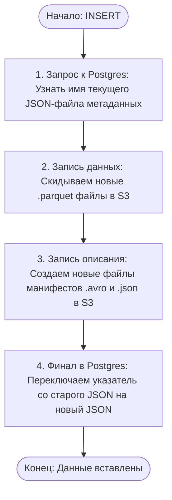
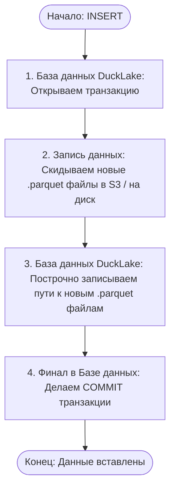

# Теория

- [DuckLake v1.0: The Lakehouse Format Built on SQL Reaches Production-Readiness](https://ducklake.select/2026/04/13/ducklake-10/)
- [DuckLake Docs](https://ducklake.select/docs/stable/)

## Виды проектирования Data-платформ

### DWH

### Data Lake

### Data LakeHouse

## Табличные форматы

### Apache Iceberg

- [apache/iceberg-rest-fixture:1.10.1](https://hub.docker.com/layers/apache/iceberg-rest-fixture/1.10.1/images/sha256-319afc30ef94300f79987b1d185c4911576db0cdfaa98246cb42757ec4d53463)
- [apache-iceberg-1.10.1/docker/iceberg-rest-fixture/Dockerfile](https://github.com/apache/iceberg/blob/apache-iceberg-1.10.1/docker/iceberg-rest-fixture/Dockerfile)

### DuckLake

